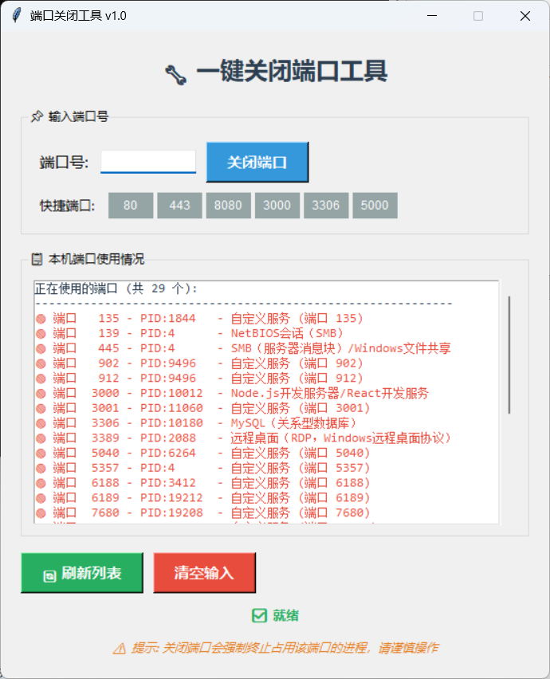
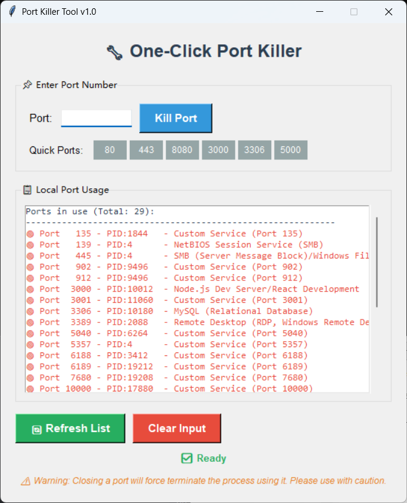

# killport

## Language

- [English](#english)
- [中文](#中文)

---

## 中文

一个方便window用户快速杀死占用端口进程的工具

每次自己想杀掉某个进程的时候忘记命令了，每次都需要上网查询cmd命令觉得过于浪费时间

由此killport就被创建出来了

这是一个window下可查看所有端口的使用情况，并且其中包含了一些常用端口的提示如3306等

## 使用

### 中文版

在有python3的环境下运行 `build_exe.bat`

生成的dist目录下的 `PortKiller.exe` 即程序

### English Version

Run `build_exe_en.bat` in an environment with Python 3 installed.

The executable file `PortKiller_EN.exe` will be generated in the dist directory.

---

## English

A convenient tool for Windows users to quickly kill processes occupying ports.

Created because I kept forgetting the commands to kill processes and having to search online for cmd commands was too time-consuming.

This is a Windows tool that can view the usage status of all ports, and includes tips for commonly used ports like 3306, etc.

## Usage

### English Version

Run `build_exe_en.bat` in an environment with Python 3 installed.

The executable file `PortKiller_EN.exe` will be generated in the dist directory.

### Chinese Version

Run `build_exe.bat` in an environment with Python 3 installed.

The executable file `PortKiller.exe` will be generated in the dist directory.